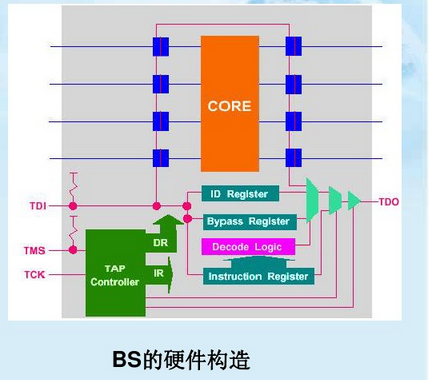

JTAG协议 标准是 IEEE1149.1

最先是几个公司成立的（1985）JETAG（joint european test action group）,最后更名为JTAG

提出了：
**标准的边界扫描体系结构**
**boundary-scan architecture srandard proposal, version2.0**
经过1990 IEEE 承认后，又提出了BSDL（boundary scan description language.边界扫描描述语言）

*注意协议和部属的区别*

IEEE 1532 标准是一个基于IEEE 1149.1 的在板编程的新标准。标准的名字为IEEE standard for in-system configuration of programmable devices

IEEE 1532 标准旨在为JTAG器件的在板编程提供一系列标准的专门的寄存器和操作指令，从而使在板编程更为容易和高效。

支持IEEE 1532的芯片在结构上多了几个寄存器和两个内部控制信号：

* ISC——Eable
* ISC——Done

### JTAG硬件结构及指令

边界扫描（BS）分为4部分：

* 测试存取通道（TAP）
* 数据寄存器组（DR）
* 指令寄存器（IR）
* TAP控制器
结构图如下：

TAP(test access point)

TCK: test clock
tck posedge -> TDI input enable
tck negaedge -> TDO output enable

TMS: test mode select

the signal received by TMS will interpreted by TAP controller, sampling TMS at posedge tck

TDI: 无论是JTAG指令还是JTAG数据都通过TDI 输入。
串行，由TAP控制器决定输入到IR还是DR

TDO：同TDI，只是在下降沿进行操作

TRST*: test reset input
*注意：TRST是可选信号，即使没有此信号，当TMS保持5个时钟周期的高电平时，JTAG器件自动进行测试逻辑复位*

fsm如下：

* 串行移位寄存器
* 每一个被测试逻辑电路引出信号线同它的引脚之间配置一个扫描单元
* 每一个独立的单元称为BSR（boundary-scan register）
* 所有的BSR通过JTAG测试激活

* 正常情况下BSR挂起状态，对芯片是透明的，不影响正常运行/

* 当芯片处于调试状态时，BSR将芯片与外围隔离。通过BSR可实现对芯片管脚的观察与控制（可capture, 可input）

* BSR 可以相互连接起来，在芯片周围形成一个边界扫描链（boundary-scan chain），一般一个芯片会提供多条独立的BSC，用于实现完整的测试功能。

* 对应于上面的状态机，JTAG扫描链一共有四种操作：挂起，捕获，移位和更新。

