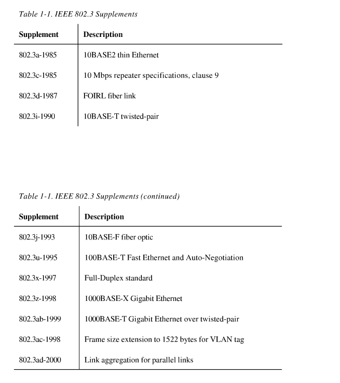
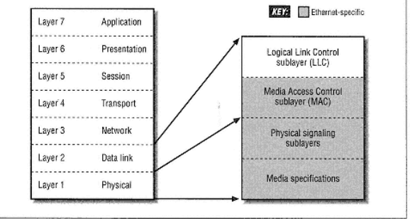
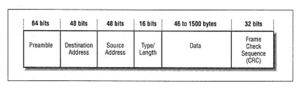

1. fast ethernet means 100Mbps ethernet

2. repeater = 中继器，switching hubs 交换机/集线器

3. help to combat incorrect "Ethernet folklore"

4. at one's elbow: very near, within reach, hard-won来之不易

* cost, scalability, reliability, management avaliable

* tenfold = ten times to

* first industry-wide ethernet stand 1980/ 10 Mbps
  fast ethernet / 100 Mbps 1995
  Gigabit ethernet 1998

* ethernet based on twisted-pair media was introduced in 1987

* ethernet management tools: SNMP simple network management protocol embedded in ethernet repeaters, switching hubs and computer interfaces provide network monitoring and troubleshooting capabilities

* downtime is expensive
  back of the envelope calculation is rough calculation

* oblique font = italian style font

## PART 1
* to date = by far 至今

* inventor of Ethernet, Bob Metcalfe (then at the Xerox Palo Alto Research Center, PARC) -- Xerox Alto PC with graphical user interfaces and mouse pointing devece

* garble 篡改， 断章取意； backoff 回退，补偿
consortium 财团, relinquish 不情愿地放弃， 废除
grained 粒度， whether or not 无论，是否

* aloha (pure aloha and slotted aloha) leads high probablilitive collision undr high load

* liseten before talk -> Ethernet channnel access protocol is called Carrier Sense Multiple Access with Collision Detect (CSMA/CD) 

IEEE Local and Metropolitan Network LAN/MAN standards Committee leads: 802.3 ethernet; 802.5 Token Ring standards.

* first Ethernet standards 802.3 is for thick (copper wire) Ethernet, next development in ethernet media was thin coaxial ethernet marketed by the 3Com corporation then IEEE 802.3 committee gave the standard the shorthand identifier 10BASE2.

* supplements (designate with a letter)
802.3a-1985 10BASE2 thin Ethernet
802.3c-1985 10Mbps repeater specifications, clause 9
802.3d-1987 FOIRL fiber link
802.3i-1990 10BASE-T twisted-pair

* IEEE forbids vendors to claim or advertise that a product is compliant 顺从，兼容 with an unapproved draft

* hierarchical layer = interlocking sets of networking hardware and software!

* OSI modeling's 7 layers:
>physical layer: electrical, mechanical 

>data link layer: station to station across a single link

>network layer: across internetwork which composed of bunch of data links, independent from lower two layer

>transport layer:reliable end-to-end error recovery mechanism

>session layer: realiable communications between two app

>presentation layer: data representation in apps

>application layer: support apps

* sublayer specified by IEEE of lower two layers of the OSI reference model

>LLC logical link control layer for identifying the date carried in an Ethernet frame （**not ethernet-specific**）
>MAC sublayer defines the protocol used to arbitrate仲裁，公断 access to Ethernet system

* misconceptive and misunderstanding are common situation in high-tech field, especially in network literature.

**optimality(最优) differs according to context**

* be wary about 小心，谨慎

IEEE identifiers of Ethernet:
three-part identifiers include the speed, the type of signaling used, and information about the physical medium

## IEEE identifiers:
**(sorted in chronological order)**
* 10BASE5
>10Mbps per second transmission speed, baseband, 500 meter maximum segment length, based on thick coaxial cable

* 10BASE2
>thin ethernet system, 10Mbps, baseband(dedicate to carrying one service:Ethernet signals),185 maximum segment length

* FOIRL
>fiber optic inter-repeater link, point-to-point link segment that could be used between repeaters,1989, immunity免疫，
>updated to 10BASE-F standard

* 10BROAD36
>broadband cable, as comterpart with baseband, supports multiple services on a single cable by dividing the bandwidth of cable into seperate frequencies, 3600meter length

* 1BASE5
>1Mbps, twisted-pair wiring
>superseded in the marketplace by 10BASE-T

* 10BASE-T
over two pairs of Catagory 3(or better)

* 10BASE-F
>fiber optic media, adopted as an official part of the IEEE 802.3 standard in Novenber 1993

>three sets of specifications:
10BASE-FB(not widely deployed) active fiber hubs based on synvhtonous repeaters for extending a backbone system.

10BASE-FP(not widely deployed) passive hub intended to link workstations with a fiber optic hub

10BASE-FL updates and extends the older FOIRL standard

**100Mbps media Systems**
* 100BASE-T: twisted-pair and fiber optic Fast Ethernet media systems

* 100BASE-X: shorthand identifier for 100BASE-TX and 100BASE-FX both based on 4B/5B block encoding system. adapted from Fiber Distributed Data Interface(FDDI)

* 100BASE-TX: 2 pair Catagory 5 twisted-pair cable(most widely used variety of Fast Ethernet)

* 100BASE-FX: multi-mode fiber optic cable

* 100BASE-T4: 4pairs of Catagory 3 or better twisted-pair cable.(scarce)

* 100BASE-T2:(never developed by any vendors)

**1000Mbps Media System**
* 1000BASE-X: 8b/10b blocking encoding scheme
>including: -SX, -LX, -CX

* 1000BASE-SX: s stands for short wavelength, x shorts for block encoding

* -LX： long wavelength

* -CX: short copper cabe media segment for Gigabit Ethernet

* 1000BASE-T: catagory 5 or better twisted-pair cable.

* proprietary专利，exotic外来, reinvent改造，

* when Fast Ethernet sdandard was brought out, the auto-negociation protocol also comeout follwed by, as make it easy to migration from 10 to 100 Mbps. when Gigabit Ethernet reinvented in 1998, this Auto-Negotiation protocol also work well.

## The Ethernet System
**four basic elements**
>frame, standardized data
>media access control protocol, embedded in each ethernet interface
>signaling components,standardized electronic devices
>physical medium, cable or other hardware carrier

* half-duplex mode admits multiple computers share a single Ethernet channel by using the CSMA/CD media access control(MAC) protocol,

### Frame
* preamble field can be omit if the system in question uses constant signaling

IEEE-SA(standards association) administers a protion of the address field by providing a 24-bit Organizationally Unique Identifier(OUI) to vendors to provide unique address for their interface they build.

* destination and source address

* 16-bit type or length field: used to identify what type of high-level network protocol is being carried in the data field.

* data field(46-1500byte) at least 46 bytes long for enough time limits. if less that 46, padding data is used to fill out the data field

* 32-bit Frame Check Sequence(FCS) field CRC

### the Media Access Control Protocol
 
* arbitrate 仲裁

* Ethernet uses a *broadcast delivery* mechanism

* multicast and broadcast addresses
>multicast: single ethernet frame to be received by a group of stations.(multicast group which can be assigned a special multicast address)
>broadcast: all the stations on the link

* deferral延期，延迟 backoff

### Ethernet Hardware

physical cabling components vary depending on media system used.

* connected segments may grow any direction except in a loop, which the frame would circulate endlessly until the system was saturated with traffic

* Round-Trip Timing(RTT)
>time takes for a signal to get from one end of the complete media system to the other and back(*means the data packet travels the whole path*). and the round-trip time is strictly limited.

>any connected system must meet the round-trip timing specification

* Ethernet Hub
>**repeater hubs** have multiple Ethernet ports. each port of a repeater hub links individual Ethernet media segments together to create a larger network that operates as a single Ethernet LAN, while switching hubs divide it into multiple seperate LANs.

>**network segmentation**: using switching hubs seperate large single Ethernet into smaller LANs to improve reliability and bandwidth

>**micro-segmentation**: switching hubs connect to individual statinos with single ports, in this time, switching hub costs have dropped and computer performance has increased. the stations have the whole bandwidth

* the TCP/IP protocol system fetch the MAC address on the channel when first trying using the Adress Resolution Protocol (ARP)

*notice ARP belongs to TCP/IP protocol suite and it sent in a **broading frame** more like a multicast group who using IP-speaking*

* there is a ARP cache memory to store

### the Media Access Control Protocol
* full-duplex Ethernet has no need for MAC protocol!!!

* Ethernet base on CSMA/CD MAC protocol known as half-duplex ethernet!!!!!

