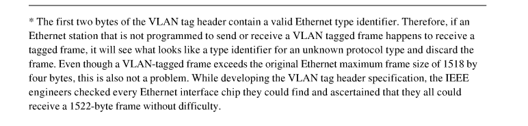
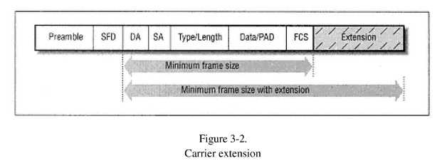
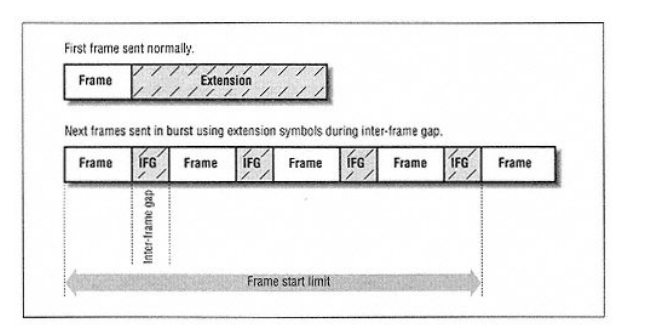

1. fast ethernet means 100Mbps ethernet

2. repeater = 中继器，switching hubs 交换机/集线器

3. help to combat incorrect "Ethernet folklore"

4. at one's elbow: very near, within reach, hard-won来之不易

* cost, scalability, reliability, management avaliable

* tenfold = ten times to

* first industry-wide ethernet stand 1980/ 10 Mbps
  fast ethernet / 100 Mbps 1995
  Gigabit ethernet 1998

* ethernet based on twisted-pair media was introduced in 1987

* ethernet management tools: SNMP simple network management protocol embedded in ethernet repeaters, switching hubs and computer interfaces provide network monitoring and troubleshooting capabilities

* downtime is expensive
  back of the envelope calculation is rough calculation

* oblique font = italian style font

## PART 1
* to date = by far 至今

* inventor of Ethernet, Bob Metcalfe (then at the Xerox Palo Alto Research Center, PARC) -- Xerox Alto PC with graphical user interfaces and mouse pointing devece

* garble 篡改， 断章取意； backoff 回退，补偿
consortium 财团, relinquish 不情愿地放弃， 废除
grained 粒度， whether or not 无论，是否

* aloha (pure aloha and slotted aloha) leads high probablilitive collision undr high load

* liseten before talk -> Ethernet channnel access protocol is called Carrier Sense Multiple Access with Collision Detect (CSMA/CD) 

IEEE Local and Metropolitan Network LAN/MAN standards Committee leads: 802.3 ethernet; 802.5 Token Ring standards.

* first Ethernet standards 802.3 is for thick (copper wire) Ethernet, next development in ethernet media was thin coaxial ethernet marketed by the 3Com corporation then IEEE 802.3 committee gave the standard the shorthand identifier 10BASE2.

* supplements (designate with a letter)
802.3a-1985 10BASE2 thin Ethernet
802.3c-1985 10Mbps repeater specifications, clause 9
802.3d-1987 FOIRL fiber link
802.3i-1990 10BASE-T twisted-pair

* IEEE forbids vendors to claim or advertise that a product is compliant 顺从，兼容 with an unapproved draft

* hierarchical layer = interlocking sets of networking hardware and software!

* OSI modeling's 7 layers:
>physical layer: electrical, mechanical 

>data link layer: station to station across a single link

>network layer: across internetwork which composed of bunch of data links, independent from lower two layer

>transport layer:reliable end-to-end error recovery mechanism

>session layer: realiable communications between two app

>presentation layer: data representation in apps

>application layer: support apps

* sublayer specified by IEEE of lower two layers of the OSI reference model

>LLC logical link control layer for identifying the date carried in an Ethernet frame （**not ethernet-specific**）
>MAC sublayer defines the protocol used to arbitrate仲裁，公断 access to Ethernet system

* misconceptive and misunderstanding are common situation in high-tech field, especially in network literature.

**optimality(最优) differs according to context**

* be wary about 小心，谨慎

IEEE identifiers of Ethernet:
three-part identifiers include the speed, the type of signaling used, and information about the physical medium

## IEEE identifiers:
**(sorted in chronological order)**
* 10BASE5
>10Mbps per second transmission speed, baseband, 500 meter maximum segment length, based on thick coaxial cable

* 10BASE2
>thin ethernet system, 10Mbps, baseband(dedicate to carrying one service:Ethernet signals),185 maximum segment length

* FOIRL
>fiber optic inter-repeater link, point-to-point link segment that could be used between repeaters,1989, immunity免疫，
>updated to 10BASE-F standard

* 10BROAD36
>broadband cable, as comterpart with baseband, supports multiple services on a single cable by dividing the bandwidth of cable into seperate frequencies, 3600meter length

* 1BASE5
>1Mbps, twisted-pair wiring
>superseded in the marketplace by 10BASE-T

* 10BASE-T
over two pairs of Catagory 3(or better)

* 10BASE-F
>fiber optic media, adopted as an official part of the IEEE 802.3 standard in Novenber 1993

>three sets of specifications:
10BASE-FB(not widely deployed) active fiber hubs based on synvhtonous repeaters for extending a backbone system.

10BASE-FP(not widely deployed) passive hub intended to link workstations with a fiber optic hub

10BASE-FL updates and extends the older FOIRL standard

**100Mbps media Systems**
* 100BASE-T: twisted-pair and fiber optic Fast Ethernet media systems

* 100BASE-X: shorthand identifier for 100BASE-TX and 100BASE-FX both based on 4B/5B block encoding system. adapted from Fiber Distributed Data Interface(FDDI)

* 100BASE-TX: 2 pair Catagory 5 twisted-pair cable(most widely used variety of Fast Ethernet)

* 100BASE-FX: multi-mode fiber optic cable

* 100BASE-T4: 4pairs of Catagory 3 or better twisted-pair cable.(scarce)

* 100BASE-T2:(never developed by any vendors)

**1000Mbps Media System**
* 1000BASE-X: 8b/10b blocking encoding scheme
>including: -SX, -LX, -CX

* 1000BASE-SX: s stands for short wavelength, x shorts for block encoding

* -LX： long wavelength

* -CX: short copper cabe media segment for Gigabit Ethernet

* 1000BASE-T: catagory 5 or better twisted-pair cable.

* proprietary专利，exotic外来, reinvent改造，

* when Fast Ethernet sdandard was brought out, the auto-negociation protocol also comeout follwed by, as make it easy to migration from 10 to 100 Mbps. when Gigabit Ethernet reinvented in 1998, this Auto-Negotiation protocol also work well.

## The Ethernet System
**four basic elements**
>frame, standardized data
>media access control protocol, embedded in each ethernet interface
>signaling components,standardized electronic devices
>physical medium, cable or other hardware carrier

* half-duplex mode admits multiple computers share a single Ethernet channel by using the CSMA/CD media access control(MAC) protocol,

### Frame
* preamble field can be omit if the system in question uses constant signaling

IEEE-SA(standards association) administers a protion of the address field by providing a 24-bit Organizationally Unique Identifier(OUI) to vendors to provide unique address for their interface they build.

* destination and source address

* 16-bit type or length field: used to identify what type of high-level network protocol is being carried in the data field.

* data field(46-1500byte) at least 46 bytes long for enough time limits. if less that 46, padding data is used to fill out the data field

* 32-bit Frame Check Sequence(FCS) field CRC

### the Media Access Control Protocol
 
* arbitrate 仲裁

* Ethernet uses a *broadcast delivery* mechanism

* multicast and broadcast addresses
>multicast: single ethernet frame to be received by a group of stations.(multicast group which can be assigned a special multicast address)
>broadcast: all the stations on the link

* deferral延期，延迟 backoff

### Ethernet Hardware

physical cabling components vary depending on media system used.

* connected segments may grow any direction except in a loop, which the frame would circulate endlessly until the system was saturated with traffic

* Round-Trip Timing(RTT)
>time takes for a signal to get from one end of the complete media system to the other and back(*means the data packet travels the whole path*). and the round-trip time is strictly limited.

>any connected system must meet the round-trip timing specification

* Ethernet Hub
>**repeater hubs** have multiple Ethernet ports. each port of a repeater hub links individual Ethernet media segments together to create a larger network that operates as a single Ethernet LAN, while switching hubs divide it into multiple seperate LANs.

>**network segmentation**: using switching hubs seperate large single Ethernet into smaller LANs to improve reliability and bandwidth

>**micro-segmentation**: switching hubs connect to individual statinos with single ports, in this time, switching hub costs have dropped and computer performance has increased. the stations have the whole bandwidth

* the TCP/IP protocol system fetch the MAC address on the channel when first trying using the Adress Resolution Protocol (ARP)

*notice ARP belongs to TCP/IP protocol suite and it sent in a **broading frame** more like a multicast group who using IP-speaking*

* there is a ARP cache memory to store

### the Media Access Control Protocol
* full-duplex Ethernet has no need for MAC protocol!!!

* Ethernet base on CSMA/CD MAC protocol known as half-duplex ethernet!!!!!

* dream up 虚构，凭空想象

* preamble field of frame only applied in 10Mbps original Ethernet, Fast and Gigabit Ethernet use this mechanism to offer compatibility backward.

* SFD start frame delimiter

* destination address field of 2 standards:
>DIX standard: (total 48 bits)first bit used to distinguish physical addresses from multicast addresses.
0-physical addr or unicast addr;
1-multicast addr

>IEEE standard: the frist bit is the same with DIX, the second bit used to distinguish between lcally and globally administered addr.
0-globally administered addr meeting OUI specification
1-self definition addrs

*notice OUI can be used to identify the vendor while troubleshooting*

* in the case of a broadcast address, the second bit is also a one in both the DIX and IEEE standard

* the actual transmission order of octets is from lefemost to rightmost, but within the octet it transmit from least significant bit through to the most significant bit
>example:
FO-2E-..
0000 1111 0111 0100

* source address can be changed by administrator or the highlevel network software

#### VLAN Tag Header
* a four-byte-long virtual LAN(VLAN) tag header may optionally be inserted in an Ethernet frame between the source address and the Length/Type field to identify the VLAN.
* switching hub will seperate the Ethernet already state above, but VLAN mechanism can make several defined VLAN ports to operate like a single LAN logically with a VLAN identifier.

* VLAN refer to IEEE 802.1Q standard for virtual bridged LANs

maximum 1518bytes to 1522 bytes

### type field or length field
* identifier refers the high-level protocol

>if the value in this field less than or equal to 1518 (maximum length of frame) , this field used as a length field to identify the number of valid data octets in data field even though there is padding data

>if the value in this field greater than or equal to 1536 decimal(0x600 hex), used as a type field identify the high-level protocol it used.

### data field

* IEEE standard: the logical link control(LLC) protocol also be used to identify the type of protocol data being carried when type/length field is used for length information.

* the LLC PDU(protocol data unit) is carried in the first set of bytes in the data field of the IEEE frame.

* **demultiplexing**: the process of figuring out which protocol software stack gets thedata in an incoming frame 

### FCS frame check sum field
* phatom 幽灵，幻象 bits by some delay in the electronics of the transceiver past the actual end of the frame called
 **dribble运球， 流口水，滴落 bits**

* so there is an interval (nearest octet boundary) after the end of carrier sense to discard the dribble bit
*notice this nearest octet boundary is truncated and discard, distinguishing from interframe gap(IFG*

* when channel becomes idle, the station waits for a brief period called the **interframe gap(IFG)**, IFG timing is set to 96 bit times.

* waiting listening called **deferring**

* If a collision is detected during the transmission, the station will continue to transmit 32 bits of data called the collosion enforcement实施，执行，强制 jam signal. if the collision is detected very early in the frame transmission, then the station will continue sending until it has completed the preamble of the frame, after which it will send the 32 bits of jam.

* 512 bits of frame transmitted without a collision through 10 or 100Mbps, said this station acquired the channel, the 512-bit time value is known as the **slot time**

* **slot time** 是一段允许ethernet system正常运行的必要时间，它包含两个时间:
1. physical-layer round-trip propagation time,传播时间
2. collision enforcement, like detece a collision and to send the collision enforcement jam sequence.

单位： bit times
大小大约是512 bit times for 10 and 100 Mbps systems
理由： let stations have enough timeto get news if a collision occurs.

#### slot time and network diameter
> for 10Mbps system, signals could travel roughly 2800 meters(9186 feet of coaxial cable and back in 512 times.

> for Fast Ethernet,
**speed of data propagation of 10Mbps and Fast Ethernet is the same!!! so the threashold of network performance id the transceiving speed!!!**

205meters(672.5 feet for coaxial cable
100meters (328 feet for twisted-pair segments

> for Gigabit Ethernet, maintains the minimum frame size at 512 bits, while extending the slot time to 4096 bits(512bytes. this is done with a system called **carrier extension**

* the Ethernet interface can detect and discard frame fragments generated by collisions as the fragmets are smaller than 512 bits and are too short to be valid frames.

* preamble field is not considered part of the actual frame

* in data field of the frame, a typical set of IPv4 headers and TCP headers in a TCP/IP packet is 40 bytes

**slot time also called the collision window**

>once the collison window has passed, the station is said to have acquired the channel.

* littered乱扔，使凌乱 with propaganda宣传

* collision detector detects circuit's average DC voltage level, since multiple transmited signals will plus up to a triger voltage level

### late collision
* normal collisions occur during the first 512 bits of frame transmission. if a collision occurs after 512 bit times, then it is considered an error and called a **late collision**

**common causes of late collision**
mismatch between the duplex configuration at each end of a link segment.
twistedpair segment with excessive signal crosstalk串音（media part) crosstalk between transmit and receive pairs cause "phantom幽灵 collisions"

* when the transceiver atteched to the Ethernet senses a collision on the medium, it sends collision presence signal back to the station interface.
*notice the interface and transceiver are two parts of ethernet attachment*!!

otherwise, if a collision is sensed very early in the frame transmission, the transmittingf stop until preamble has been sent complitely and then sends out 32 bits of jam signal and stops transmitting.

* transmitting scheduling process -- **truncated binary exponential backoff**, truncated refers to the limit set on the maximum size of the exponential

>the practical effect is that after the first collision on a given frame transmission, the interfece may wait zero slot times.

>after ten retries, the value of k stops increasing, which represents the truncation of the algorithm. If the frame continues to encounter collisions after 16 tries, the interface will give up. 

### Gigabit Ethernet Half-Duplex Operation

>gigabit ethernet 一般是用的half-duplex，几乎没有half-duplex
mode equipment for that

>repeaters can only be used in a half-duplex, shared Ethernet channel. by definition, anything connected to a repeater hub must be operating in half-duplex mode.

* notoriously difficult众所周知
conundrum 复杂问题

### carrier extension

>notice: the use of carrier extension bits assumes that the underlying physical signaling system is capable of sending and receiving non-data symbols based on signal encoding schemes

>like padding data will full out the data field of original frames, frames of 64bytes(512 bits will be extended with 448bytes resulting 512 bytes.(maximum)

* frame extension will reduce the efficiency when send frames of small size on half-duplex channel, to solve this conundrum, defines an optional capability called **frame bursting**

>the total length of a frame burst is limited to 65,536 bit times plus the final frame transmission

>the frame bursting station keeps the channel active by transmitting special symbols as non-data symbols that all satations understand during the interframe gap times of the frames

>the transmitting action is allowed to continue sending frames in a burst until the Frame Burst Limit(FBL is reached, which is the time to the start of the last frame in the burst.

### Collision Domain
collision domain refers to a single half-duplex Ethernetsystem whose elements are all part of the same signal timing domain

### Ethernet Channel Capture
the best known example illustrate MAC protocol is not perfect id an effect called **Ethernet Channel Capture**

* contention争论， fray争辩

> even though Ethernet Channel Capture effect will happen, but the system will also achieve **long-term fairness**

>

