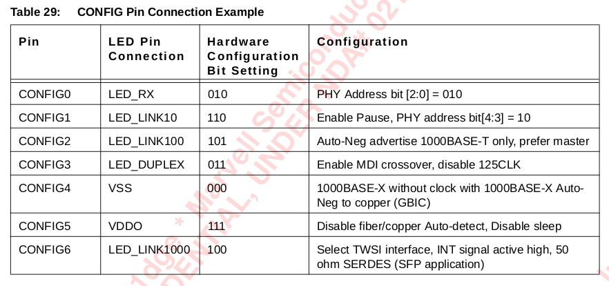
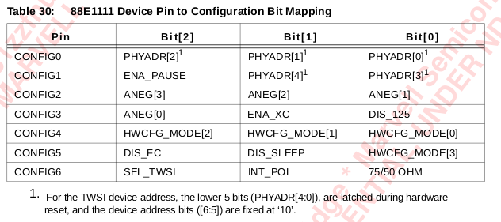
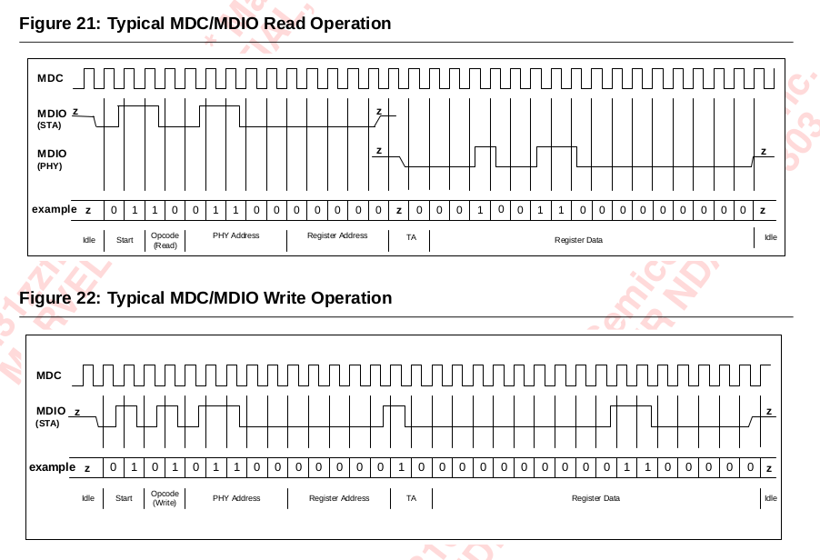

1. IEEE defines 32 registers address space for PHY
paging mechanism used for extend registers' number

page0,register0
15-0
15. software reset 	1
14. loopback 		0
13. speed select(lsb)	
14. auto-negotiation enable	

## physical coding sublayer
PCS resides at the top of the physical layer (PHY), and provides an interface between the Physical Medium Attachment (PMA) sublayer and the Media Independent Interface (MII). It is responsible for data encoding and decoding, scrambling and descrambling, alignment marker insertion and removal, block and symbol redistribution, and lane block synchronization and deskew

## 高速数据接口形式

* ECL 和PECL（positive）
PECL 标准最早由motorola公司提出  

* CML 电路：电流模式逻辑，相比于PECL，它直接在内部集成了阻抗匹配的50 ohm电阻。所以在互连的时候可以直接相连（直流），或者耦合电容就可以了。
CML 电路比ECL 电路功耗小

* LVDS = low voltage differential signaling
信号摆幅小，所以能在低电压运行。
* IN+ IN- 输入差分阻抗为100ohm，输入级还包括一个自动电平调整电路。将共模电压调整为一个固定值。（adaptive level shifter）.其后是具有滞回特性的sxhimitt trigger,再后面才是差分放大器。

* 在光传输系统中，没有CML 和LVDS 的互连问题。因为LVDS 通常用作并联数据传输，而CML通常用作串行数据传输。

* transceiver 会由一个signal detect output 到MAC

* MAC interface在选择模式的时候主要是配置HWCFG_MODE REG

* SERDES INTERFACE ACTUALLY AND SGMII ARE TWO DIFFERENT INTERFACE！！！！

* auto-negociation advertise information is send by MAC and used by PHY to control the media!!!

#### hardware configuration
configuration options like physical address, PHY operating mode, auto-negociation, MDI crossover(ENA_XC) and physical connection type are configured by using the configuration pins,

* 需要给CONFIG[x]赋值，一个CONFIG是3bit大小

the CONFIG[6:0] inputs come out to the corresponding config pins.

....................................
#### interfaces
XTAL1 = external reference clock

COMA pin: disables all active circuitry to draw absolute minimum power, the COMA power mode can be activated by asserting high on the COMA pin. 

> in coma mode, the PHY cannot wake up on its own by detecting activity on the CAT 5 cable.

* HSDAC+-: test pins. these pins should be left floating but brought out for probing.

AVDD: analog power 2.5v
DVDD: digital power 1.0 or 1.2v

VDDOH: 2.5v power supply for LED and CONFIG pins
VDDOX: 2.5v for MDC/MDIO INTn,125CLK, RESETn,JTAG pin
VDDO: 2.5v for MAC interface

VSS: global ground
VSSC: ground reference for XTAL1 and XTAL2.connected to the ground

NC: no connect

the mapping value of led_out and config pins are shown below:pin

the config pins configuration bit mapping are shown below:

some typical config pins:

* ANEG[3:0] auto-negociation configuration for copper modes
* ANEG[3:2] for fiber modes

* ENA_XC enable MDI crossover function. 
**if the MDI crossover function is diabled, then the device assumes the MDI configuration.**

* HWCFG MODE[3:0]

* DIS_FC disable fiber/copper interface auto selection

* DIS_SLEEP energy detect

INT_POL : interrupt polarity(active HIGH or LOW)

#### seperator
EMI: electro magnetic interference
包括传导，辐射，谐波，闪烁

EMC: electro magnetic compatibility

EMS: ~ sensibility

EMC 包括EMS（对外界）和EMI（自身造成）

### multi-mode DAC
very low parasitic loading xapacitances to improve the return loss requarement, which allows the use of low cost transformers.

> slew rate control and partial response(waveshaping)

* slew rate 就是电压转换速率（Slew Rate），简写为SR，简称压摆率。其定义是在1微秒或者1纳秒等时间里电压升高的幅度

## 线路编码（line coding）
线路编码又称信道编码。其作用是消除或减少数字点信号中的直流和低频分量。

>线路编码大体上分为三类：扰码二进制， 字变换码， 插入型码

**以上问题太过复杂。参看通信原理相关专业教材（后补）**

SNR or S/N signal noise ratio 信噪比

* 88e PHY device employs a on-chip hybrid to substantially reduce the near-end echo, which is the super -imposed transmit signal on the receive signal.

## echo canceller
residual echo not removed by the hybrid due to patch cord impedance mismatch, patch panel discontinuity and variations in cable impedance along the twisted pair cable.

## NEXT canceller
the device employs 3 parallel NEXT cancellers on each receive channel to cancel any high frequency cross talk.

## baseline wander(基线漂移) canceller
also known as DC shift

## digital adaptive equalizer(均衡器)
The digital adaptive equalizer removes inter-symbol interference at the receiver. The digital adaptive equalizer takes unequalized signals from ADC output and uses a combination of feedforward equalizer(FFE) and decision feedback equalizer（DFE） for the best-optimized signal-to-noise ratio.

## digital PLL

## link monitor
responsible for determining if link is established with a link partner.

## management interface (重点)
management interface includes MDC and MDIO

**CONFIG中的address[4:0]地址是为了MDIO中用的！！！**

typical w/r operations are belowing:

at high MDIO fanouts the maximum rate may be decreased depending on the output loading.

## MDC/MDIO protocol

88ee1111 器件中，hardware configuration 就是将CONFIGs 和 LED 等一些I/O口连接起来；而software configuration就是通过MDIO，MDC来对reg 进行设置！！很明显，后者的功能要多很多，而且还有一个称之为 MDC/MDIO protocol的标准协议。

## two-wire serial interface
TWSI 相当于是提供了一个bus，可以多个88e作为slave 连接。然后共享一个master，可用于MDIO，MDC 共享。。。
此时：
MDI -> SDA(serial data line)
MDC -> SCL(serial clock line)

## auto-negotiation

